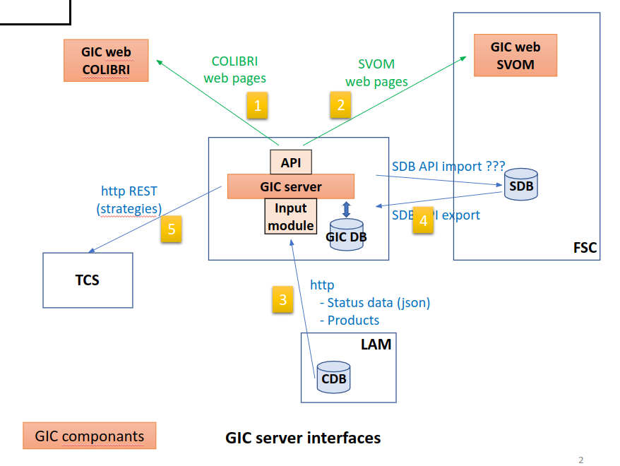

# GIC server
Le Gic server a pour objectif principal de répondre aux demandes des interfaces Gic web svom et gic web colibri, il est accompagné d’une base de donnée GIC-DB-SERVER, afin de stocker et répondre aux différentes requêtes,
Le Gic-server est un serveur de fichier et de stockage basé sur Nodejs 

Il est  destiné a  :
-  Se connecter aux différentes base de données (SDB, DB) en respectant les protocoles de sécurité et  d’authentification,
-  Récupérer des Fits et extraire des données afin d’offrir des données exploitable sous forme d’api(Svom Alerts)
-  Scanner des dossiers de réception, récupérer et insérer les données dans la GIC-DB-SERVER (Sensors, Calibration)
- Compiler des données de plusieurs sources vers un fichier JSON (Stratégie),
- Traitement en lot des fichiers  JSONB de la CDB,  en les insérant dans la GIC-DB-SERVER, afin de rendre les données disponibles pour les interfaces WEB,




### Objectif

L’application devra pouvoir : 
- 	Se connecter à la base de données « Colibri database », et afficher les données significatives des capteurs sur une page web,
-	Vérifier les données json dans la base de données CDB.
-	Faire des statistiques sur tous les capteurs,
-	Vérifier la maintenance

## Mise en place

| contraintes        | Todo      |
| ------|-----|
| - Créer la base de données PostgreSQL, mise en place en ligne| 	|
| - Connexion à la base de données PostgreSQL| 	|
| - Méthode de connexion à la base PostgreSQL Auth? CPPM/OHP/ LAM (Chrystel)  | 	|
| - Sauvegarde reguliere? Au LAM, les données sont sauvegardées et assumé par le SCIP  | 	|
| - Stratégie pour rapatrier les données  | 	|
| - Liens des fichiers de stockage(LAM)  | 	|
| - Vérifier les données json dans la base de données CDB | 	|
| - LAM mets a disposition une api (svom.iap.fr ) avec la liste des fichiers json.  | 	|
| - Temps de rafraichissement des données | 	|
| - Recupération des données colibri. (d'aprés  le LAM, toute les 1h voir 4 h,) voir avec SCIP| 	|
| - Récuperation svom alerts et transmission en moins de 5 minutes ?| 	|
| - Update calibration Json sur le data storage avant traitement par la colibri database :warning:| 	|
| - Insérer des données, possible ? Ex : sur les détails device (Date de création, utilisation, fiche technique, marque, etc )| 	|
| - Fixer la structure de la base de données, Structure entités + id catégories, id groupe| 	|
| - - Etablir la structure d’un fichier Json afin de stocker les données de tous les capteurs Colibri (GFT)| 	|


## Reunion Discussion

### 02/2020


| Date        | Contenu      |
| ------|-----|
| 02/20 | - Fixer base de données,	Structure entités + id catégories, id groupe|
| 02/20 | ***REUNION Michel, Johan, Francois***|
|| - Structure JSON|
||    - Des ajouts a apporter ->Ups dans categories, seing monitor (camera qui regarde la polaire) dans origin.|
|| - L'organisation du fichier semble coherente, pour une application qui supervise|
|| - Les besoins les plus courants sont la meteo et les alertes Sous categories|
|| - sous-categories supplémentaires, mais risque de compliquer le boulot a Alan?|
|| -  Un compromis serait d'ajouter un filtre sur les unités (C°, Humidité).|
|| - maintenance preventive autour du nettoyage des capteurs, graissage, remplacement des onduleurs tous les 5 ans ?|
|| - QUESTIONS	Quelle données à verifier? , stockage des données ?, exemple de site?|


	  
| Date        | Contenu      |
| ------|-----|
| 02/20 | ***REUNION Michel***|
| | - TCS encapsule des données dasn un fichier JSON, et stocké dans le datastorage, puis au Lam |
| | - 3 colonnes supplémentaires sur le fichier d'Alan |
| | -  La colonne Fits Header n'interesse pas le GIC,  |
| | -  garder a partir de la ligne 33, (regler la valeur GIC follow-up a yes), commande pour remplacer un capteur existant |


### 06/2020

| Date        | Contenu      |
| ------|-----|
| 09/06/2020 | ***REUNION Michel, Damien , hafid***|
|| - maintenance preventive ???  |
|| -  pas de données a inserer dans le GIC, (eventuellement ajouter des valeurs d'un capteur),  |
|| - identifier=  est interessant pour remplacer la meme piece, et verifier les differentes valeurs  en cas de remplacement. |
|| - firmware est  interessant de le conserver aussi en cas de modification, ca permet de retrouver les erreurs programmes |
|| - 12 capteurs de temperatures sur le telescope |
|| - dans Category faut enlever focuser (c'est destiné  a l'observationd e cagire), filter (enlever c'est dans les fits),  |
|| - 43/48 B ET R, mesure la pression du CCD |
|| - On garde donc DRAGGO_R et  DRAGGO_B |
|| - Seeing monitor (ajouter ORIGIN), instrument independant , (attaché aux observations), mais interessant de le monitorer a long terme. |
|| - 46 à 48 DRAGGO_R |
|| - MSTH environnement de DRAGGO, |
|| - Structure |

Alan propose un document gérés par le tcs , pas d'information subjective


### QUESTIONS

 	Établir la structure d’un fichier Json	-afin de stocker les données de tous les capteurs Colibri (GFT), test
 	Insérer des données, possible ? 	Ex informations sur les détails device (Date de création, utilisation, fiche technique, marque, etc ) test
ALAN	Validation de la structure JSON,	 Doit 'on instaurer une liste fixe, avec MAJ periodiquement, , liste des categories et groupes a partager


## API

 - 1 COLIBRI web pages :  toutes les données arrivent exclusivement par la GIC-DB-SERVER via une API, la page est accessible via les membres LDAP de Colibri

- 2 SVOM web pages : pour certaines rubriques Echange de données  via une API (stratégies , weather, sensors) ,
Pour la rubrique Svom Alerts des Fits sont téléchargés via la SDB-export, et exploités afin d’extraire les données et les proposer via l’api,
Les accès à l’espace Svom se fait à l’aide D’auth et keyclock,


## JSON Strucuture

###  Sensors

#### How we use this data in the GIC Web:
Automatic management of the list of sensors assuming the same subsystem and component
The subsystem-component tree is kept
A list of sensors is immediately available within this tree structure

We finally agreed on a JSON status data file structure
See below an example of a JSON status data file structure

####  Sensors JSON Details on classification:

subsystem: one of “ddrago”, “plc”, “tcs”, “cagire”, etc, …

component: the component within the subsystem. For example, in DDRAGO red and blue channels would be components, as would be the “instrument” (the support structure and all of the mechanics) and the “close-electronics”. 
In the TCS, the components would be the individual computers. In the PLC, one component might be the weather station

group: This is a horizontal classification of the kind of sensor. 
For example, one might be “environmental-temperature”, and this would be the same for all of the environmental temperature sensors in all of the subsystems. 
Another might be “host-disk-space-used”, and this would be used for computers. 

####  Sensors JSON status data files structure

 Discussion autour de la structure Json. 

Google Docs Sensors and Values
 [https://docs.google.com/spreadsheets/d/1H6wwW1Uxq9pjpo-oJhTEFjH2WtMTyhqehk5r-JDoUnM/edit#gid=0](https://docs.google.com/spreadsheets/d/1H6wwW1Uxq9pjpo-oJhTEFjH2WtMTyhqehk5r-JDoUnM/edit#gid=0)

#####  03/06/2020

```json
"device": [
       {
         "date"       : "2019-10-01T23:59:06",
         "name"        : "date start",
         "origin"     : "DDRAGGO1", //categories (Hardware, Telescop(dont dome), PLC,  CAGIRE, DRAGGO 1, DRAGGO)
          "group"      : "environmental-sensors", // peu importe le nom (group ou categories)
         "value"      : "0.01",
         "pretty_name": "shed light level",
         "model"      : "iButtonLink MS-TL",
         "identifier" : "26.5584E1010000",
         "firmware"   : "",
         "type"       : "float",
         "unit"       : "V",
         "error_code" : 0
```

##### 04/2021

```json
 {
      "name"       	: "C0-detector-detector-temperature",	Name of the sensor
      "value"           	: "+0.0",						Value of data
      "date"            	: "2021-03-23T02:54:10",			0Date of data collection
      "pretty_name	: "C0 detector temperature",			0Precision on the name, comment
      "subsystem"    	: "instrument",					Name of a part of the whole system
      "component"  	: "C0",						Name of a sub part in subsystem
      "group"           	: "detector-temperature",			0An information for classification
      "model"           	: "dummy",						Model of the sensor
      "identifier"      	: "0",							Identifier of the sensor
      "firmware"        : "",							Firmware of the sensor
      "type"          	: "float",						Data type: integer, float, string
      "unit"            	: "C",							Unit of data
      "correction_model": "",						Correction model to reconstruct raw values
      "raw_value"   	: "+0.0",						Raw value from the sensor
      "error_code"  	: 0							Precision on the validity and quality of the data			
    }
```

##### 09/2021

```json
{
      "name"       	    : "C0-detector-detector-temperature",	Name of the sensor
      "value"           : "+0.0",						        Value of data
      "date"            : "2021-03-23T02:54:10",			    Date of data collection
      "pretty_name“	    : "C0 detector temperature",			Precision on the name, comment
      "subsystem"    	: "instrument",				        	Name of a part of the whole system
      "component"  	    : "C0",						            Name of a sub part in subsystem
      "group"           : "detector-temperature",		    	An information for classification
      "model"           : "dummy",					        	Model of the sensor
      "identifier"      : "0",							        Identifier of the sensor
      "firmware"        : "",							        Firmware of the sensor
      "type"          	: "float",						        Data type: integer, float, string
      "unit"            : "C",							        Unit of data
      "correction_model": "",						            Correction model to reconstruct raw values
      "raw_value"   	: "+0.0",						        Raw value from the sensor
      "error_code"  	: 0							            Precision on the validity and quality of the dat
    }
```

###  Calibration
Every day, if calibration images were taken, candidates are created
On this occasion, a status data file is created for the GIC
This is a JSON file with a dedicated structure for calibration status data (see below)

####  Calibration JSON status data files structure

##### date...todo différence?

```json
 {
       "IM_NAME":"bias_20180306T021123_C0_w_2.fits.fz",   Name of the candidate of the day
        "TYPE": "bias",                                   Type of the candidate
        "DATE": "2018-03-06 02:11:23",                    Date of the creation of the candidate
        "INSTRUME": "C0",                                 Name of the instrument that generated the raw images
        "FILTER": "w",                                    Name of the filter used on the instrument
        "MEAN": -0.014200019650161266,                    Mean of the candidate image
        "MEDIAN": -0.016615156084299088,                  Median of the candidate image
        "RMS": 0.3763885200023651,                        Standard deviation of the candidate
        "MEANDIFF": 0.20666106045246124,                  Mean of the difference between candidate and master
        "MEDIANDIFF": 0.2067536860704422,                 Median of the difference between candidate and master
        "RMSDIFF": 0.5899637341499329,                    Standard dev of the difference btwn candidate and master
        "VALID": false                                    Result of validation
    },	 

```

```json

  {
       "IM_NAME":"bias_20180306T021123_C0_w_2.fits.fz",  Name of the candidate of the day
        "TYPE": "bias",							                     Type of the candidate
        "DATE": "2018-03-06 02:11:23",			          		Date of the creation of the candidate
        "INSTRUME": "C0",								                  Name of the instrument that generated the raw images
        "FILTER": "w",								                  	Name of the filter used on the instrument
        "MEAN": -0.014200019650161266,					          Mean of the candidate image
        "MEDIAN": -0.016615156084299088,			          	Median of the candidate image
        "RMS": 0.3763885200023651,				            		Standard deviation of the candidate
        "MEANDIFF": 0.20666106045246124,				          Mean of the difference between candidate and master
        "MEDIANDIFF": 0.2067536860704422,			          	Median of the difference between candidate and master
        "RMSDIFF": 0.5899637341499329,			            	Standard dev of the difference btwn candidate and master
        "VALID": false								                   	Result of validation
    },
```