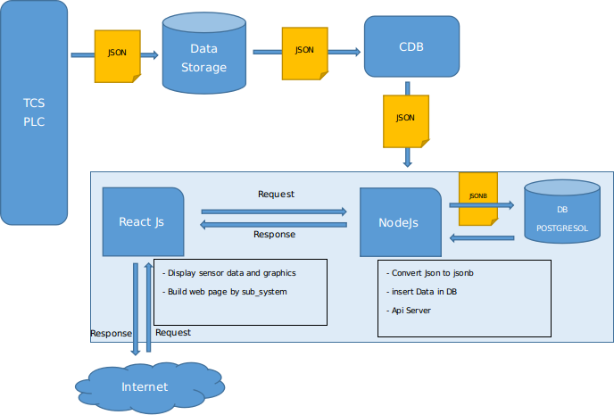

# Gic web colibri (OHP)

L’interface permet de visualiser les données d’état à moyen et long terme de l’observatoire ( environnement, dôme, télescope, instruments, hardware)
- Afficher les plannings d’observation de SVOM
- Gérer des stratégies d’observation SVOM
- Visionner et valider les fichiers de calibration de référence
- Scheduler : Contrôler le calendrier des alertes
- Produits : Créer et gérer l’interface entre Colibri-Database et Svom-Database



 Réaliser l’interface utilisateur du Centre instrumental (GIC) avec les fonctionnalités suivantes :

- 1	Interface Web et API : Surveillance de l’environnement interne de l’observatoire  (infrastructure, télescope et instrument),
- 2	Stratégie : Lister et modifier les stratégies d'observation,
- 3	Scheduler : Contrôler le calendrier des alertes.
- 4	Calibration : 
- 5	Produits : Créer et gérer l’interface entre Colibri-Database et Svom-Database

## Module Général

- Guide installation ( Postgresql, NodeJs, Mysql, Docker) 
- Hébergement du site web chez colibri.lam.fr pour les utilisateurs Colibri
- Module de Connexion User, Admin , Module accessible selon les droits 
- Gérer l’interface de COLIBRI Interface avec le FSC (Même utilisateur , même mot de passe?)
- Hébergement de page web spécifiques au FSC, questions sur les pages, et hébergement.
- Maquetter les futures pages du monitoring Colibri,
- Tester l'application pour valider un taux de couverture de 80% Sonarqube

##  Device sensors

L’application devra pouvoir : 
- 	Se connecter à la base de données « Colibri database » via l'Api, et afficher les données significatives des capteurs sur une page web,
-	Vérifier les données json dans la base de données CDB. todo
-	Faire des statistiques sur tous les capteurs,
-	Vérifier la maintenance todo


Difficultés : catalogue des capteurs homogénes, cohérents et compréhensible
Objectifs : Obtenir une liste des capteurs  rapide en 2 selections ()

| Theme        | Contenu      |
| ------|-----|
| general |Etablir page TEMPLATE |
| |Faire des statistiques sur tous les capteurs |
| | 1er plot selon critères celcius ou mbar |
| |temps : NOW (ONE WEEK) default, ONE MONTHS, TRIME |
| | Vérifier la maintenance |
| |Sur le design, (cumul des fonctions C°) |
| |monitoring des capteurs avec alarmes |
| |remplacer logo colibri |
| |verifier le reset zoom, ajouter des espaces de temps (10)zoom |
| |Attendre les retours concernant le selecteur de date |
| |humidity entre o et 1, humidity enlever le pourcent et entre zero et 1 |
| | ajouter les unités sur les graphes (quand y'a humidity RIEN, watt dans les power, ) |
| Sensors|Faire des statistiques sur tous les capteurs |
|  |1er plot selon critères celcius ou mbar |
| |Select en cascade Catégories, Groups, Devices |
| |Comment récupérer un Id catégories dans les devices ?  |
| |Comment récupérer un Id catégories dans les devices ? |
| | Possibilité de tracer toute variable en fonction de toute autre variable + temps. |
| Divers|remplacer logo colibri|
| |supprimer, admin url, et  |


From these data, we built a model that allows to display graphs automatically. The guiding idea of this system is that we want to minimize the intervention of the developer when the number of sensors, families of sensors, subsystems, will grow.

The principle is the following:  

· In the "status" tab, we look for the exhaustive list of subsystems

· In each subsystem, we display a template. This template is composed of :

o Grouped graph for the temperatures, another for the humidities, and finally another for the pressures.

o We also display a list of sensors of this subsystem, we can click on an item of this list and display a temporal graph of this sensor

 

From this model of json file, the GIC automatically generates web pages. Description based on actual data follows :


Divider


-- |--Draggo

Web page model 

-- |--PLC

Web page model 

-- |-- Telescope,

Web page model 

-- |-- Oan, etc ect ..( plc, cagire , hardware, seeing-monitor)

Web page model 


The application automatically generates a divider (a web page) for each sub_system.
Each divider automatically generates a web page template  with all its sensors.

Web page model = Each web page is divided into 2 parts:
 1st part, A graph display of all sensors related to temperature, humidity, pressure
2nd part A list of other sensors, clickable for display in a single graph


With this framework, all sensors can be displayed


## weather

| Theme        | Contenu      |
| ------|-----|
| general |Ex.  http://iris.lam.fr/previsions-meteorologiques/ |
| |A mettre carte jour nuit sur l'application |
| weather|exception sur status summmary supprimer (status) |
| | Insérer des données, possible Ex informations sur les détails device |
| | Possibilité de tracer toute variable en fonction de toute autre variable + temps. |
| | Main weather sensors: tracés de l'évolution temporelle (nuage, température, vent, humidité…) |
| | Valeurs météo + environnement: proviennent directement de l'automate et des détecteurs.  |
| |  Sur le design, (cumul des fonctions C°) |
| | ajouter le vent, la vitesse du vent, les blocs journées http://iris.lam.fr/previsions-meteorologiques/ 24H |
| | afficher les derneires 24h, dASHBOARD PROCHAINE NUIT, |
| | ajouter 3 bloc, prevision whether forecast + weather |
| | ajouter 3 plot http://iris.lam.fr/monture-du-telescope/ |
| | camera intercalaire + OK weather forecast  |
| | pas de histogramme pour 'humidité  |
| | NO (meteo sur site principale) rajouter ligne pour le vent  |
| | Pas d'export  |
| | effacer forecast  |


## performance

## Stratégies

GIC génère et propose des stratégies d'observation et enfin, stocke et offre des données d'étalonnage. Les stratégies sont élaborées localement. (le GIC envoie également ces informations au FSC en cas de besoin).
Les images :
- Les valeurs zéro et d'observation sont calculées à la 1ère étape de la GP1 (réduction des données)
- Valeurs météo + environnement: proviennent directement de l'automate et des détecteurs.
- Bias, Flat et Dark sont prises par TCS et transférées en France pour stockage et validation.
Une base de données indépendante dans laquelle nous stockons des données de statut, des calendriers, des stratégies et des liens d’images de calibration

### Objectifs 

Fabriquer et publier des stratégies d’observation SVOM
Stratégie : Lister et modifier les stratégies d'observation,


#### A réaliser

| Theme        | Contenu      |
| ------|-----|
| general |Créer une interface web afin d’ajouter, modifier les stratégies d’observation |
|  |lister l’historique des validations des stratégies. |
|  |Un processus indépendant capable de recevoir des données de TCS-GP1 selon une structure de fichier bien définie et de les insérer dans DB ?	 |
|  |Ou stocker les stratégies ?	 |
|  |Stratégies d’observation publiées sur une API REST, pour TCS, Scheduler, FSC BA	 |
| TCS to alert  |** Need to decide an interface for TCS to alert which alert is |
| BA |page web, destiné au BA que pour les SVOM |
|  | recherche dans tcs, the alert liste (résumé de l'alerte |
|  |propose a webpage bouton (modifier, continuer, changer de mode, specifier des coordonnées) |
|  |propage l'action a tcs |
|  |message pour le BA, si bruit de fond,   Ras,si contre partie Informer le BA  |
| svom |** Check that there is no interference between SVOM and colibri world
verifier ce qui n'est pas svom
 |

**Link to download the data to do analysis later in a python notebooks (CSV format). Download the full set of data (every 5min). For the chosen time.
specifier date , début, date fin
**Add long term bouton for the display of the sensor "

## Scheduler

Scheduler : Contrôler le calendrier des alertes.


Colibri est contrôlé localement par un programme automatisé (CC), générant en interne son propre calendrier en fonction des alertes SVOM reçues, TOO ou des demandes d'utilisateurs externes.
Ce programme automatisé est auto-piloté avec peu d'interactions avec l'opérateur.

#### realiser

| Theme        | Contenu      |
| ------|-----|
| general |Lister les alertes Svom du Scheduler.	|
|  |Suite à une alerte Svom, Etablir un rapport dans les 4min30 |
|  |Un second rapport sur l’analyse des images devra être fourni |
|  |Suite |
|  |Suite |
|  |Suite |


```json
	MONDAY	TUESDAY	WEDNESDAY	THURSDAY	FRIDAY	SATURDAY	SUNDAY
						1	2
Stéphane							
François						oui	oui
Johan						oui	oui
Samuel						Shift	Shift
Pascal						Shift	Shift
Damien							
Michel							
Alan							
	3	4	5	6	7	8	9
Stéphane							
François							
Johan	oui	oui	oui	oui	oui	oui	oui
Samuel	Shift	Shift	oui	oui	oui	oui	oui
Pascal	Shift	Shift	Shift	Shift	Shift	Shift	oui
Damien	non	non	non	non	non	non	non
Michel	oui	oui	oui	oui	oui	non	non
Hafid	oui	oui	oui	oui	oui	non	non
```

## Calibration


### Objectifs 

 Réaliser l’interface utilisateur du Centre instrumental (GIC) avec les fonctionnalités suivantes :

| Theme        | Contenu      |
| ------|-----|
| general |fonctionnalités	|
|  |formulaire pour montrer les tendances à long terme des images de calibration. |
|  |Niveau de biais: tracés du niveau de biais (médiane de plusieurs images) pour chaque tracé de canal de l'écart type (nouveau - réf) pour chaque image de biais |
|  | Flat: tracés du niveau uniforme, uniformité (médiane de plusieurs images) pour chaque canal et pour chaque bande tracée de l'écart type (nouveau - réf) pour chaque bande |
|  |Dark level: tracés du niveau sombre (médiane de plusieurs images) pour chaque canal et pour 2 expositions (long / court) des tracés de l'écart type (nouveau - réf) pour chaque image (Autre monitoring plots for CAGIRE?) |
|  |zero offset: tracés de l'évolution temporelle de la magnitude pour chaque bande |
|  |Seing: tracés de l'évolution temporelle pour chaque canal |
|  |calibration plot année mois jour pour bias et dark juste l'instrument (pas de filtre jamais) et pour le flat couple instrument filtre |
|  |latests calibration status file, |
|  |master par validated valide yes or no (croix si valid)|
|  |regler le probleme de firefoxe |
|  |Demarrage du graphique a partir de la date end |
|  |**Change scale for mean/RMS for flat/dark/biais |
|  |exponentiel sur les erreurs |
|  |- 	Ajouter intervale regulier dans calibration dans graph, si pas de candidat , un trou |
|  |median afficher decimal |
| Graphique |Garder toujours les memes couleurs,  |
|  |reajuster l'echelle |
|  |meme plot avec les rms diff + mean |
|  |NO (damien)niveau de filtrage (acceptable ou pas) {}
rms diff + mediam |
|  |PLOTS rms +median (pas de validation true ou pas) |
|  |2eme PLOTS rms diff + median diff (validation candidat a prendre en compte) |
|  |OK "candidat valide et candidat Non valide" |
|  | annotations : nom du candidat a afficher sur info bulle |
|  |calibration virer HHmmSS |
|  |Echelle 3 mois affichage par défaut|
|  |tableau 10 derniers + ascenseurs |
|  |26/03 triangle vert si candidat valide, rouge non |
|  |26/03 marqueur plein  |
|  |verifier le reset zoom |
|  |ajouter des espaces de temps (10)zoom |
|  |valide yes or no (croix si valid) |
|  |Log a enlever |
|  |Attendre les retours concernant le selecteur de date |
|  |master par validated valide yes or no (croix si valid) |
|  |adresse admin/calibration |
|  |liste des capteurs grisées |
|  |zoom ->details |
|  |affichage regler largeur |
|  |summary, vider les tableaux |
|  |supprimer seconde dans calibration, dans tooltip , axis |
