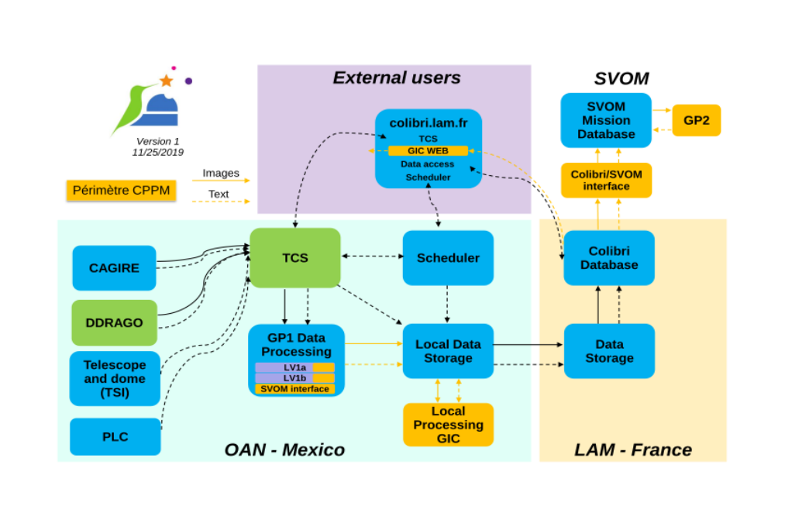
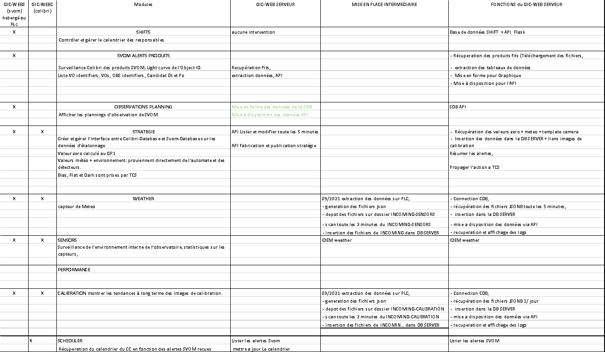
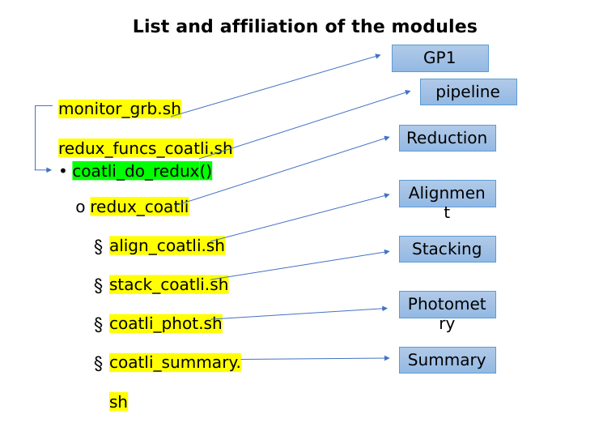
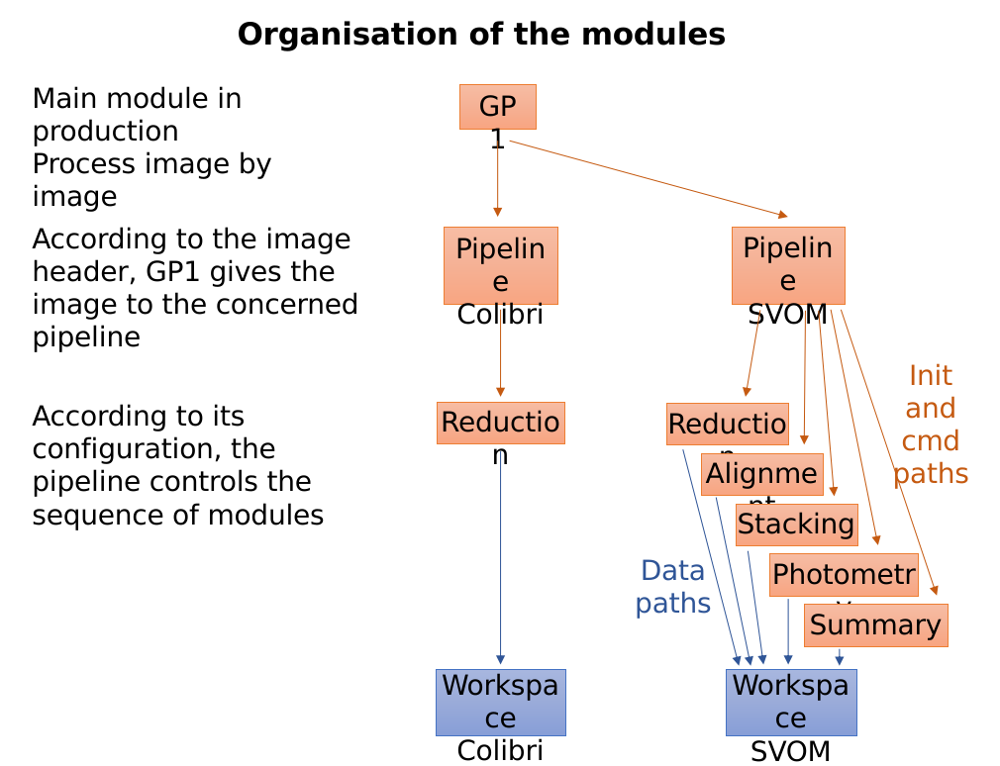
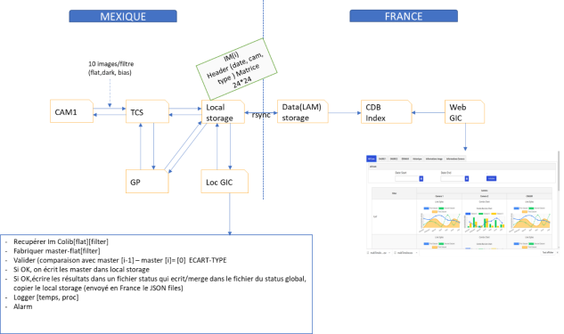
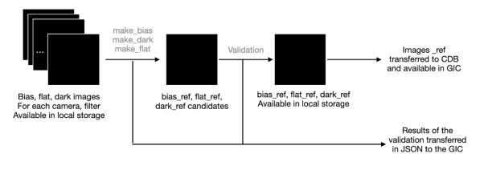
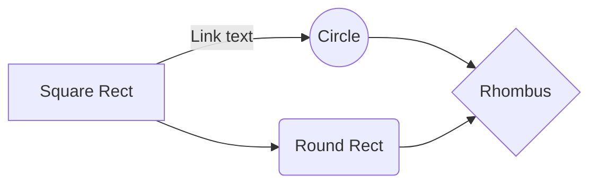

# Gic components



## Gic interfaces description

**GIC-SERVER - >  LAM-CDB** : 
pour les status data : 	
- le serveur récupère les données stockées dans la CDB au format JSONB,  
- Data sensors => un fichier toutes les 5 minutes, Calibration 1 fichier json /jour)
- Les data du JSONB sont insèré dans la de données du gic-db-server
- Les données peuvent finalement être disponible via une API
-  Toutes les images colibri sont disponibles dans la CDB (a exploiter? )                

**GIC-SERVER - > SDB** :
- des fits sont échangés dans le cadre d’une alertes svom, 
- le but est d’en extraire  des données pour établir des graphiques, et les  rendres disponibles via l’api,
- l’Api de la SDB permet d’alimenter le GIC-WEB-SVOM sur la liste et les détails des produits FGFT et certains mot clés,

**GIC-SERVER - > TCS** :

****GIC-SERVER - > TCS stratégies ****

TCS génère et propose des stratégies d'observation et enfin, stocke et offre des données d'étalonnage. 

Les stratégies sont élaborées localement. (le TCS envoie également ces informations au FSC en cas de besoin).
Les images :
- Les valeurs zéro et d'observation sont calculées à la 1ère étape de la GP1 (réduction des données),
- Valeurs météo + environnement: proviennent directement de l'automate et des détecteurs,
- Bias, Flat et Dark sont prises par TCS et transférées en France pour stockage et validation.

Une base de données indépendante dans laquelle nous stockons des données de statut, des calendriers, des stratégies et des liens d’images de calibration
Le GIC-SEVER  
  -  Récupère des valeurs zéro + météo + template camera
  -   Insère les données dans la DB SERVER + liens images de calibration
  -  Résume les alertes, 
  - et renvoi  l'action a TCS




## Svom alerts parsing

Receive VO events and parse them in order to trigger observations. Comet is waiting for new VO events, from remote or local place. As soon as VO event is received, a parsing is done and a trigger file is built

https://www.cppm.in2p3.fr/~ageron/alertes-svom/

### List of files


|        | Contenu      |
| --|-----|
|  requirements.txt |o List of required packages |
|parse-last-voevent.py  | Triggered by comet (--cmd option). Stdout of Comet is inserted in stdin of this module. This module tries to find a burst ID which is used in the trigger file name produced in this module|
| parse-last-voevent.sh | parse-last-voevent.py needs a parameter, this format is impossible to enter in the --cmd option of comet. parse-last-voevent.sh allows to do this|
| colibri.log|Log file housing most important steps of the test  |
| ivo__org.svom_fscsb22020379_eclairs3 |An original VO event generated by FSC from an eclairs trigger|
|ivo__svom.lal.in2p3.fr_SVOM_AlertSVOM20220207F603_________ | An original VO event generated by FSC from a GW alert |
|colibri-dc3 |	A csh script that runs the DC3 test. Only lines 69 to 84 are relevant here, they show how to launch comet to listen locally or remotely|
| trigger_sb22020379.dat|	Example of trigger file generated by parse-last-voevent.py on reception of an eclairs VO event |


### Tests

**Receive test**

VO events are received by Comet, we can run Comet to listen :

• Locally

``` >twistd -n comet --local-ivo=ivo://svom/colibri --receive-port=8099 --receive --printevent --cmd=./parse-last-voevent.sh 
	
	VO events are expected on port 8099 of the local machine. Here is an example to send a VO event from local machine  

	>comet-sendvo -f VO-event_to_send -p 8099  
```

• Remotely
	
``` >twistd -n comet --local-ivo=ivo://svom/colibri --remote= fsc.svom.org:20099 --printevent --save-event --save-event-directory=./ --cmd=./parse-last-voevent.sh

	VO events are expected from fsc.svom.org:20099 (FSC @CC Lyon)
```

**Parse test**

A local test based on a dedicated VO event is possible :

Eclairs VO event

``` 
>cat ivo__org.svom_fscsb22020379_eclairs3 | parse-last-voevent.sh
Parses an eclairs VO event then produces a trigger file called « trigger_ sb22020379.dat »
 ```

GW VO event

```
>cat ivo__svom.lal.in2p3.fr_SVOM_AlertSVOM20220207F603_________ | parse-lastvoevent.sh
Neither burst ID nor obs ID exist in this VO event. The purpose here is to test that parsing
does not crash. No trigger file is produced.
```

## GP data processing


| N°        | Contenu      |
| --|-----|
|  |***Description et génération des mots clés*** |
| |Installation de l’outil json_product-descriptor |
| |Création fichier TSV |
| |Description des mots clés dans une feuille excel ;  |
| |Choix des mots cles, Choix du contenu et de l’ordre   (http://saada.unistra.fr/svom/products/) |
| |Exécution du compilateur |
| |	Contrôle des erreurs  |
| |	Génération du fichier JSON  |
| |	Génération du fichier FITS  |
| |	***API IMPORT-EXPORT***  |
| |	Insertion du schéma du produit dans la SDB  |BA
| |	Contrôle de la fiche produit  |
| |	Insertion d’un FITS concordance JSON/FITS  |
| |	Contrôle du FITS  |
| |	***NATS***  |
| |	Controle des opérations	  |
	

### Create Master / Calibration


Les images de calibration sont produites par TCS et envoyées à la CDB, les liens vers ces fichiers d’images étant envoyés à GIC dans un fichier JSON.
	***Image Calibration(TCS) --> CDB --> GIC (Liens CDB.json)***

GIC a besoin de ces liens pour accéder aux images de calibration afin de les valider.

#### Procédure 

Sources des fichiers: marsvom1 /usr/local/var/coatli/bin


| N°        | Contenu      |
| --|-----|
| 1 Recuperer fichier MASTER dans le dossier DarkBank|le fichier MASTERDarkBank sera comparé au fichier_1 de 2017DARK|
| |Nous obtenons un nouveau fichier a comparer avec le fichier_2 de 2017DARK|
| |Nous obtenons un nouveau fichier a comparer avec le fichier_3 etc etc|
| 2 - Le comparer au premier fichier du dossier 2017dark	| Comparer - soustraire pixel par pixel,Cela nous permets de tracé la distribution de tous les pixels(centrés sur zero)|
| |- Recuperer la dispersion stat sur chaque pixels|
| |-histogramme et renvoyer les RMS de la distribution|
| |Calculer le MIN(centré a zero)|
| |et le RMS (compatible avec les stats)|
| 3 - Etablir un fichier JSON d'informations MIN RMS|stocker dans un JSON les données : date, camera, filtrer , min dat, min flat, rms|
| 4 - Si nouveau Master, |ecraser le MASTERDB, garder l'ancien sous OLD|
| 4) GIC tracer|tracer l'évolution du MIN et du RMS|
| 5 - Graphique GIC||


| N°        | Contenu      |
| --|-----|
| |récupère 10 fits, recalibrer avec la moyenne du master bias. et réécrire les master bias|
| |Comment extraire les données automatiquement, afin de  les traiter a la volée, ?|
| |Quel type de serveur traitera ce processus ? sur l'interface ou en background?|
| |Même Nom de source des données tous les jours?|
| |Seul les fichiers de calibration doivent être stocké|

COMMUN
Dans astropy voir Mpack pour ces calculs, il existe des outils pour tracé la distribution des pixels automatiquement


#### Plan calibration

Calibration procedure:
0 - Acquisition 
TCS applique son plan de calibration chaque jour (début/fin de nuit). Il fait l’acquisition d’une série d’images de flat/dark/bias.

1 - Calcul
Sur chaque série d’images, il faut créer les fichiers de references en faisant la coalition des fichiers individuels. Cette étape est faite avec les fonctions du GP1 (coatli_do_bias, coatli_do_dark, coatli_do_flat dans la version de marsvom1).

2 - Validation
Une fois qu’on récupère les fichiers de reference, il faut les valider. Pour cela, on calcule la distribution des pixels de l’image soustraite (new-ref). On utilise la valeur du mean doit être centrée 0 et avec un RMS faible. On peut aussi travailler avec le rapport au lieu de la difference, dans ce cas, le rapport doit être centré sur 1.
Todo: faire un petit programme qui récupère les nouveaux fichiers master, vérifie les headers, fait les calculs de difference (pixel-by-pixel) et valide les fichiers si par exemple: Mean =[-2,2], RMS=[0,3] (valeurs à verifier). Mettre ces valeurs limite dans un fichier de config externe.

3- Data transfert to GIC
JSON file {IM_NAME, TYPE, DATE, ORIGIN, TELESCOP, INSTRUME, FILTER, MEAN, MEDIAN, RMS, MEANDIFF, MEDIANDIF, RMSDIFF, VALID} 
- => IM_NAME: name of the image
- => TYPE = flat, dark, bias
- => DATE = date of acquisition of the 1st image
- => ORIGIN = OAN/SPM
- => TELESCOP = COLIBRI
- => INSTRUME = DDRAGO1, DDRAGO2, CAGIRE
- => FILTER = g, r, i, b, v, J, H, w
- => MEAN = Mean of the values of all pixels
- => MEDIAN = Median of the values of all pixels
- => RMS = RMS of the values of all pixels
- => MEANDIFF = Mean of the values of all pixels (new - ref)
- => MEDIANDIF = Median of the values of all pixels (new - ref)
- => RMSDIFF = RMS of the values of all pixels (new - ref)
- => VALID = Quality flag of the validation (True/False) 

Pour les 7 derniers paramètres, il faut donner:  name, value, type, unit, errorcode

4 - Affichage GIC 
Une page par type de fichiers de calibration (x3)
Sur chaque page, on affiche pour chaque INSTRUME et FILTRE
- les valeurs MEDIAN, RMS en fonction de DATE
- les valeurs MEDIANDIF, RMSDIFF en fonction de DATE
- Tableaux de valeurs: MEAN, MEDIAN, RMS, MEANDIFF, MEDIANDIF, RMSDIFF
- s’il y a un probleme (VALID=False): un message de warning


### GP1 Produits lv1a lv1b

Module d’analyse interactif chargé de retraiter les images SVOM en temps différé

- Contient des pipelines identiques à ceux du GP1
- Utilisés manuellement par les Instruments Scientists de Colibri pour raffiner les résultats
- Module tourne au FSC indépendamment de l’orchestrateur (container)

Ce processus autonome est chargé de :
- La réduction des toutes les images (L1a)
- L’analyse des alertes SVOM + MM (L1b) au pied du télescope 
- 

Nat Butler est responsable de la fourniture des pipelines
- Nous avons des réunions régulières avec lui pour travailler sur l’amélioration des pipelines pour le science case SVOM (accélération, pages web, présentation des résultats, fabrication des produits)
- Entrées: Récupère les images de TCS + les informations des VOevents
- Fabrication du Produit => Ecrit les résultats au format fits dans le Local Data Storage qui sera poussé dans la CDB puis dans la MDB et disponible pour le BA
	***Fabrication Produit --> Fits(Data Storage)--> CDB --> MDB***
- L1A Nat fournit les données → les images L1A sont calibrés et stockés dans LocalStorage et DataStorage
- L1A  Ils doivent etre ensuite indexées dans la SDB puis envoyées au FSC

- L1B Des images sont envoyées , et ensuite des produits sortent transformées
- L1B Nat Butler est responsable de la fourniture des pipelines

• Nous avons des réunions régulières avec lui pour travailler sur l’amélioration des pipelines pour le science case SVOM (accélération, pages web, présentation des résultats, fabrication des produits)

| N°        | Action      |
| --|-----|
|fits|Fabrication de produits du core program (fichiers fits))|
|Validation des résultats|• Ecriture dans le Local Storage prêt à être transmis en France|
||• Log et reporting|
|RATIR |Une version du pipeline est installée au CPPM Des tests vont commencer avec des images RATIR|
|Entrées| Récupération des images de Colibri dans la MDB via l’API d’export.|
|Récupère|Récupère les images de TCS + les informations des VOevents|
|Sorties|Sorties	Ecrit les résultats au format fits dans le Local Data Storage|
|Sorties|Sorties: Si les IS valident les nouveaux résultats, écriture des nouveaux produits dans la MDB via l’API d’import.|


| N°        | Avancement      |
| --|-----|
| | ***HEBERGEMENT DU PROGRAMME***|
| | Serveur ? garantie d’exécution ? Privilège ? Répertoire et accès extérieur|
| | Restauration du service ? Monitoring du service?|
| | Fichier de configuration : adresse entrée, valeur de déclenchement, adresse de sortie,|
| | |
| | ***DECLENCHEMENT DU PROGRAMME***|
| |Quel est l’élément déclencheur |
| |La présence dans la SDB de nouveaux produits, Henri utilise comète pour déclencher les processus automatiquement |
| |Script de détection de nouvelles informations dans la CDB |
| |creer un container pour lire et envoyer, lire dans la sdb, lire api d'import,lecture de la messagerie Nat |
| |  ***CREATION DU PROGRAMME SDB/CDB , Vérification des données***|
| |Sélection des produits HD, et validation, Vérification de la qualité des produits |
| |- les liens Fits Stockés dans le Data storage, à insérer ? |
| | Pour les produits Hd validés, Transmission des produits dans l’import, Comment les taggers?|
| | Envoi des données|
| |Insertion des données dans la CDB des produits contrôlés |
| |Gestion des logs |
| |Besoin de la SDB ? |
| |Versement des produits dans la SDB |
| |Récupération des images via l’API d’export. |
| | Sorties: Écriture des produits scientifiques en SDB|
| | Les fichiers sont stockés au LAM, pas de stockage FSC?|
| | Rubrique Aide API  Générer une documentation pour l'API via http://apidocjs.com/|


### GP1 adaptation for Colibri

- COATLI, DDOTI, RATIR pipelines are well suited for post processing of images
- Colibri’s pipeline needs:
 	- Online mode : Image by image processing for the first images after receiving an alert notice
 	- Offline mode : post processing for a batch of images (same functions) 
	- Simultaneous use of 2 instances of the same online pipeline (Colibri, SVOM)
- COATLI pipeline only processes offline mode
- We work to adapt the pipeline for online with a better structure and documentation
- In order to fit Colibri’s pipeline needs, we add a software layer over the Coatli pipeline
- No change on the COATLI image analysis
- This new software layer is written in python, it is there to facilitate access to the main functions of the pipeline
- All the modules (functions) are independent, configurable by a configuration file specific to each one
- Several CLI allow to access to:
		- A module
		- A pipeline 
		- GP1
 - Documentation web ….link

Coatli pipeline job is to process images of the day
Input data are organised in a serie of directories on the GP1 workdir

Day date  YYYYMMDD

	Data type		0001 flat
				0002 bias
				0003 dark
				1000 GRB

		Instrument   C0 / C1 / C2

			Filter   0: w, 1: BB, 2: BV, 3: BR , 4: BI
 images (.fits.fz)
 

monitor_grb.sh				Make a source list according to data type
  
	redux_funcs_coatli.sh		Copy source files
	Create manifests
	Run redux_coatli for each instrument and filter

redux_coatli				Main routine of the pipeline : 
								if not given, calculates flat, bias, dark  
								run reduction process

align_coatli.sh			Run alignment process

stack_coatli.sh			Run stacking process

coatli_phot.sh			Run photometry process

coatli_summary.sh		Image substraction, search candidates, update web 						pages


- Reduction results and logs are written  in a workspace located in source data tree




 
#### Test of the modules

Each module was tested separately
We supply both new modules and and original pipeline with the same images
We compare at each step the content of text and fits files


#### Access to the "module" level

- A module is able to process one or more images 
- Each module is configurable through a dedicated configuration file 
- Every module may be tested independantly
- CLI : module_name 	--input (-s) dir or images list 
					--output (-r) dir 
					--config (-c) config_file
- Example: reduction --input input_dir --output output_dir --config reduction.cfg
- reduction will reduce fits files in input_dir, put the results in output_dir according to reduction.cfg
	
```
[Input and Output]
input  = /data/pipeline_test/Data/20191016/raw_images
output = /data/pipeline_test/output_V6

[Calibration]
dark = /data/pipeline_test/Data/20191016/masters/dark.fits
flat = /data/pipeline_test/Data/20191016/masters/flat.fits
bias = /data/pipeline_test/Data/20191016/masters/bias.fits

[Parameters]
ps            = 0.000195
gain          = 6.2
sat_level     = 7000
detect_thresh = 1
```

#### Access to the “pipeline" level


- A pipeline is able to invoke one or more modules
- A pipeline is configurable through a dedicated configuration file 
- It will be used for the offline analysis
- CLI : pipeline  --config (-c) config_dir
- Example: pipeline --config config/svom
- Output directory is built according to some keys present in the fits headers (alertID, instrument, filter)

```
[Workspace]
headers = TRGID,INSTRUME,FILTER
 
[Input and Output]
input  = /data/pipeline_test/Data/20191016/raw_images
output = /data/pipeline_test/output

[Structure of pipeline]
reduction = yes
findstars = no
alignment = no
stacking  = no
Photometry =no
Image subtraction = no
Summary = no

[Strategy processing]
mode = standard
```
#### GP1 level


- Online oriented, GP1 manages 2 instances of the pipeline
- CLI : gp1  --config (-c) config_file
- Example: gp1 --config config/gp1.cfg
- Tested with updated pages (headers), an extern process send images regularily
- To be tested with 2 instances of pipeline

```
[General]
input    = /data/pipeline_test/Simulation_online/input 
log_path = /data/pipeline_test/Simulation_online/output

# Pipelines
[pipeline-test]
processing_strategy = standard	
identifier_header   = EXPTYPE,OBSERVER
identifier_value    = object,svom
configuration_path_dir  = /data/pipeline_test/GP1-V7/config/pipeline-test
workspace_dir       = /data/pipeline_test/Simulation_online/output
```




#### GP1 status


Modules Reduction, Alignment, Stacking are done and tested in a previous version (without configuration)
Test is done on files content (text and fits)
Modules Reduction and Alignment are available in the current version
Pipeline works with reduction, very soon with other modules	


#### Pipeline description

https://gmadet.readthedocs.io/en/latest/index.html

Source extraction: Sextractor
Stacking: Swarp
Astrometry: scamp
PSF fitting: PSFEx
CR removal: LC cosmic algorythm
Subtraction image: hotpants
Outputs: files
Well structured and documented

#### gmadet as possible back-up

Installed on marsvom2: /data/gmadet
Just tested that it is working with the provided test images
Will start soon to adapt for COATLI images


### Device Sensors

## GP 2

Module d’analyse interactif chargé de retraiter les images SVOM en temps différé
- Utilisés manuellement par les Instruments Scientists de Colibri pour raffiner les résultats
- Module tourne au FSC indépendamment de l’orchestrateur (container)

pipelines identiques à ceux du GP1
Récupération des images de Colibri dans la MDB via l’API d’export
 IS valident les nouveaux résultats
écriture des nouveaux produits dans la MDB via l’API d’import.

TODO


###	BA Tools

TODO
###	GP2 data processing

Module d’analyse interactif chargé de retraiter les images SVOM en temps différé
- Utilisés manuellement par les Instruments Scientists de Colibri pour raffiner les résultats
- Module tourne au FSC indépendamment de l’orchestrateur (container)


| N°        | Contenu      |
| --|-----|
| |pipelines identiques à ceux du GP1|
| |Récupération des images de Colibri dans la MDB via l’API d’export|
| | IS valident les nouveaux résultats|
| |écriture des nouveaux produits dans la MDB via l’API d’import.|


##	Local processing 	


###	GIC local processing données d’etat	

####	Gestion des données d'état

Ce module collecte les données d'état de différents fournisseurs, les fusionne et les rend disponibles pour la synchronisation du stockage des données

Les prestataires sont:
- TCS pour les données d'état du télescope, des instruments, du PLC, etc ...
- Planificateur pour le calendrier prévisionnel
- GP1 pour les données sur l'état des performances

Un fichier de données d'état JSON est mis à disposition toutes les 5 minutes


```
{
      "name"       	    : "C0-detector-detector-temperature",	Name of the sensor
      "value"           : "+0.0",						        Value of data
      "date"            : "2021-03-23T02:54:10",			    Date of data collection
      "pretty_name“	    : "C0 detector temperature",			Precision on the name, comment
      "subsystem"    	: "instrument",				        	Name of a part of the whole system
      "component"  	    : "C0",						            Name of a sub part in subsystem
      "group"           : "detector-temperature",		    	An information for classification
      "model"           : "dummy",					        	Model of the sensor
      "identifier"      : "0",							        Identifier of the sensor
      "firmware"        : "",							        Firmware of the sensor
      "type"          	: "float",						        Data type: integer, float, string
      "unit"            : "C",							        Unit of data
      "correction_model": "",						            Correction model to reconstruct raw values
      "raw_value"   	: "+0.0",						        Raw value from the sensor
      "error_code"  	: 0							            Precision on the validity and quality of the dat
    }
```


 [Last JSON status data files structure, détails](../gic-server.md)


###	GIC local processing produits	




Processus autonome chargé de valider les images de calibration 

* Entrées: Récupération des images de calibration dans Local Storage
* Fabrication et validation des images de calibration de référence : dark, bias, flat. A partir des images individuelles prises quotidiennement par TCS
* Sorties: Ecriture des images de référence (fichier unique et validé) sur Local Storage pour utilisation dans le GP1
* Mise en forme des fichiers status
  

| N°        | Contenu      |
| --|-----|
| |Entrées: Récupération des images de calibration dans Local Storage, 	|
| |Fabriquer master -flat	|
| |A partir des images individuelles prises quotidiennement par TCS|
| |validation des images de calibration de référence : dark, bias, flat.|
| |Sorties: Ecriture des images de référence (fichier unique et validé) sur Local Storage pour utilisation dans le GP1	|
| |Mise en forme des fichiers status|
| |-Créer un fichier Mock, grâce au FITS précédent pour les futurs tests|
| |-Etablir une connexion entre la SVOM database et la Colibri database, afin de pousser nos produits.|
		

>? erreur ?	Entrées: Récupération des images de Colibri dans la MDB via l’API d’export.			

#### Calibration production & validation	

La validation de l'étalonnage est effectuée à l'aide du pipeline de N Butler (ASU)
Le processus est lancé après la fin de la période d'observation
Si aucune image d'étalonnage n'a été prise, rien n'est fait
Pour chaque couple instrument-filtre, un candidat est construit
  
La validation se fait en 2 étapes:

Un test de disponibilité est effectué pour chaque candidat
Chaque candidat est comparé au master correspondant
Selon certaines coupes, les candidats deviennent le master





####	Svom scientific products creation & validation	

Ce module crée et remplit les produits scientifiques SVOM selon un modèle
Actuellement 7 modèles sont disponibles
Les modèles et les fichiers créés sont au format ajusté
Le code de ce module a été développé pour les besoins du test DC2
??? Les entrées de ce module sont les résultats du pipeline GP1

> Ce module extrait les données (images L0, L1a et produits des produits scientifiques du CP) , les valide et les écrit dans la Scientifique DB,

##### Cohérence des données CDB Vs SBD,

Objectifs Adaptations des Produits pour la Scientifique Data-base


| N°        | Contenu      |
| --|-----|
| Test du générateur des fichiers produits| |
| |Description des mots clés dans une feuille excel ; |
| |Choix des mots cles, |
| | Choix du contenu et de l’ordre  (http://saada.unistra.fr/svom/products/) |
| |Génération des fichiers Mock (fichiers tests) |
| Traitement des données|Dans la moulinette de Laurent . |
| | Différence entre Data/import et data produits et template |
| |Dans la moulinette import, je donne un tsv, j’obtiens un json |
| |Dans la moulinette produits, je donne un tsv, j’obtiens un json et un fits |
|Description et génération des mots clés | |
| |Installation de l’outil json_product-descriptor |
| |Création fichier TSV |
| |Description des mots clés dans une feuille excel ; |
| |Choix des mots cles, Choix du contenu et de l’ordre  Visit [http://saada.unistra.fr/svom/products/](http://saada.unistra.fr/)   |
| |Exécution du compilateur  |
| |Contrôle des erreurs |
| |Génération du fichier JSON  |
| |Génération du fichier FITS |
|File descriptors : | File descriptors : [https://drf-gitlab.cea.fr/svom/common/message-schemes/-/wikis/file_descriptors](laurent sur https://drf-gitlab.cea.fr) |
| |Les descripteurs de fichiers sont des fichiers json  |
| |conformes au schéma Visit [http://saada.unistra.fr/svom/schema/ ](product_schema.json )  |
| |Ils peuvent être générés à partir de fichiers TSV. |
| |Un utilitaire permet de générer des modèles FITS à partir de descripteurs de fichiers.  |
| |Ces modèles peuvent être utilisés pour valider la chaîne de traitement. |
| Versement des produits dans la SDB|Fabriquer |
| API IMPORT-EXPORT|Insertion du schéma du produit dans la SDB  |
| |Contrôle de la fiche produit  |
| |Insertion d’un FITS concordance JSON/FITS  |
| |Contrôle du FITS |
| |Récupération des images via l’API d’export. |
| |Sorties: Écriture des produits scientifiques en Scientifique Database |
|La description des produits | doit être partagée par différentes parties du FSC |
| | Le pipeline doit les connaître pour générer des fichiers de données conformes.|
| |La base de données scientifique a besoin d'une description des produits à ingérer |
|réutilisation des mots cles |Certains ensembles de mots clés sont destinés à être réutilisés dans différents produits. |
| | Il est important de s'assurer qu'ils ont partout les mêmes définitions |
| | Ceci est réalisé par le external mécanisme. |
| |- Les ensembles de mots clés peuvent être stockés dans des fichiers séparés. |
| |ces fichiers séparés sont publiés dans le Visit [[ http://saada.unistra.fr/svom/products/](http://saada.unistra.fr) |


|        | Suivi des Informations      |
| --|-----|
| NATS|Controle des opérations |
| |Fabrication des produits scientifiques en SDB Processus au FSC |
| |Vérification de la qualité des produits |
| |Sorties: Ecriture des produits scientifiques en MDB |
| |Gestion des logs |
| |Entrées: Récupération des images de Colibri dans la MDB via l’API d’export. |

| N°        | Questions      |
| --|-----|
| |insertion image |
| |curlfits |
| |Boucle plusieurs candidats,	 |
| |réduction	 |
| |rien sur les produits,		 |
| |mettre nul sur optimiseWarning	 	 |
| |Gestion des logs	 	 |
| |Entrées: Récupération des images de Colibri dans la MDB via l’API d’export.


### GP1 data processing  vs observations  Svom

####	Produits GFT	


| N°        | Contenu      |
| --|-----|
| Precision 16/06/20|DT-TO colibri (temps de detection de la contrepartie  d'un filtre donnée)|
| |Voir schema |
|COMMUN |tgid, GFT OBID, idcand seront modifiés|
| |-Meta Data|
| |Creer une structure de schema, dans l'api d'import, pour les sr3|
| |(verifier les imports si on peut ajouter les meta dans la moulinette de laurent)|
| TO|svom est un detecteur de rayonBird (rayon gamma), svom et taillé pour voir ce genre des  eclairs.|
| |svom detecte les GRB, et il faut une 2eme contrepartie qui est colibri (contrepartie optique)|
| |contrepartie =identification avec un autre instrument|
| |TO = detection SVOM (utc)|
| |VO Contient un TO et un RADEC, Colibri fait des observations|
| | Tobs = Temps de chaque image  COLIBRI|
| |DT = Tobs si il y'a au moins un candidat, |
| |DT = (DTR = Tobs),  devient un DT |
| |DT(R) un candidat sur le filtre rouge|
| ||
| ||
|METADATA (Nouveau FITS) |Pour chaque produits ou GRB il y'a un fichier METAdata, qui comprendra une image|
| |instrume, gft_tgid, gft_obid, puis les 7 dernieres colonnes du fichier Html,|
| |1 ligne par observation|
| |Cumul pour méta pour renvoyer schéma|
| |Lire l'image Header ensuite Ajouter des informations|
| |- Récupérer l'image,|
| |- lire l'image(les données sont insérées par les cam)|
| |- lire fichier Fits pour division Bin à bin|
| |Modèles sont comparés à la base (PDB/IAP) , vérification de la cohérence avec la pdb a développer.|
| |Selon le hmtl fits fournit par Damien :|
| |-exemple filtre VRJ->HVR|
| |start+expo= datstartT0|
| |DELTAT= Tstart-Tz, et non pas (tstart-dt)|
| ||
| ||
| Le DT(time detection) |aura 6 lignes une ligne pour chaque filtre|
| |DT et DT MJD = null pas les autres|
| QF  |lieu du temps (Exptime 90-60) Mag 19.10, snr 5|
| |5 filtres si pas de de détection en upperlimit (>300 sec)|
| |si pas detected (mag, dt, mager, exptime ==0)|
|  |LCFGFT detected=0,|
| PO.|fom=1;|
| |equinox = j2000(fixe)|
| |les informations (ra-dec) sont à prendre sur la ligne candidat|
| |ra/dec(données equatoriales) pour obtenir l et b->convertir les données équatoriales en galactique|
| |Ra (enlever les 0.0000)|
| |-Pas de deltat pas de (Mag, Ra, Dec)|
|UPLIM  | (a supprimer si candidat jamais détecté)|
| QLC Mag en fontion du temps|tout entre 0-300|
| |delta max = 300|
| |(détection Time -T0 ou Temps -temps sursaut)|
| |detected valeur (0 ou 1)|
| |tstart 98 tend 128, jusqu'a 300 sec ensuite upperlimit|
| |delta = to(detectionsvom +30)|
| |exptime (start -stop)|
| |snr = 2a = valeur AB|
| |mager= 0.06(1erligne)|
| |image=2d|
| |Groupby filter Orderby date and "detection"="=" if > alors valeur null|
| | LC ET QLC detected = 0 |
|LC  | (22 lignes)|
| |Toute les observations, magnitude en fonction du temps |
| |on écrit dans la matrice, toute les lignes et detected a true si =, false si >|
| |Ajouter BOOLEAN|
| QTI entrée par filtre| (donc 6 entrées) a partir du QLC|
| |(MAG, IMAGE) a supprimer|
| |FITSnorm 1d|
| |tfistart j=90 tfitt selon...fichier QLC|
| |-pour chaque filtre (4 points) le plus court TFSTART|
| |cela permet d'obtenir 3 nombres (FITSNORM, FITINDEX, FITCHI2)|
| |il faut donc au moins 2 candidats (chdi, filtre, start, strop , resultat)|
| |ajouter ERFITINDEX|
| |si un seul parametre Null, null sur les 5 dernieres colonnes|
| |???? mettre nul sur optimiseWarning|


> **Note:** IMAGES png dans matrice
Pour les images voir si on peut intégrer les jpeg, sinon le liens ira très bien
Nous aurons la fonction ici présente Ecriture, mais nous aurons aussi la fonction lecture des fits a développer, et




####	produits chinois


1) Main questions from Chinese teams

 |N° | Contenu   | |
|--|--|--|
|	HEAD 0 ET HEAD | | exactement pareil pour tous les produits.  DTGFT  comme modéle.HEAD 0 ET HEAD(peut avoir plusieurs valeurs par produit)|
| | | je regarde dans le header pour trouver des informations general, si candnumb>0 , alors je regarde dans la partie data|
|| | 	Bien faire la différence entre GLOBAL, et details	|
 |META DATA|	 	 |  ne peux pas etre dans header, meta data , New HDU possible. | |
 |	CANDNUMB |	candidate number, 0 = no new source detected.	 |CANDNUMB est nombre de candidats detecté,(pas par filtre, globale)car il n'est pas dans le HEAD, |
  |	FCHART |	png file, how to input it …  |	insert links |
  |	MY_VERS |	pipeline version? |	re-processing version in filename extension |
  |	ADD ?    |selected in pink in the file	 |	TRIG MJD Ajouté partour dans les headers. |
  |	  | 	 | DATE-OBS, TIME-OBS, CANDNUMB, UPLIMIT, FCHART (po), STARUTC(qlc), ENDUTC (qlc), TRIG_MJD(qlc, lc, qti) |
  |	IMAGEID	2. | No fit is nan 	valide | pour '' rien du tout 'vide' zero , etc pas de nan |
  |	IMAGEID QLC, LC	 |use imageid instead of image , 50A	 |imageId, (nom de l'image ou a été detecté ce candidat), + url ou trouver le jpeg |
|IMAGEID DT,PO 	 |image id |（ how to name?, [S_filter_Number// combine image: C_filter_number, filter=0: all filtler combined）  |
  |	MAGERR |	magerr will be consistent with vention?	  |
  |	DATE |	Chaque image a une date avec une detection	 |DT c'est la premiere fois, ensuite chaque image il y'a une nouvelle date |
  |	DATE-OBS, TIME OBS|	1er fois ou la contrepartie a été detecté,|| 	 
 |QF,PO, DT, LC |	TIME-OBS	 |what is difference between objectid and sourceid |	SOURCEID=  / to cross match with an external catalogue, |
| |	| OBJECTID=  / Unique identifier of the source in DB , |
| |	|Sur svom,  si il existe plusieurs candidats dans un meme champ,  |
| |	|nous sommes obligé de donner plusieurs Id (sequence...). |
| |	| recuperer, plusieurs Id  pour combiner un id unique, en cours de définition.. |
 |DT	  | |	DT_GFT_i    DT_GFT_FGFT i =fgt ou cgft |	supprimer 15 et 17, uplim vas dans un produit general, imageID dans data, imageId(le nom de l'image) je la mettrais en complement a gft trig |
 |DT |	MJDREF |	57754 , what does MJDREF mean?	Modified Julian Date of reference datefor increased precision. A voir |
 |PO	  |	qpo=po	 |10 pas d'interet a mettre dans das, FCHART URL, IMAGEID  a mettre dans 3.5 |
 |QF	  |	 	 |Detected ne sert a rien, car si , imageID APRES, detected et uplim a virer (car plusieurs filtre), Si une seule camera UPLIMIT ok, la c"'est pas possible.? |
 |QF	 |DT_MJD |	DT_MJD may be prefer, it can be used for light curve plot directly. |	 Mettre les 2, YYYYMMDDTHHMMSS, MJD et DT |
 |QLC	| |	=LC	AJOUTER TRIG MJD ok,|
| |	|imageID CORRECT,|
| |	|detected a garder,|
| |	|uplimite pas besoin ,|
| |	|magerr=erro,  magerr = valeur de la magnitude, (si detected mag et magger=0) car mag = magnitude limite de l'image et donc  magerr = 0, => 18|
| |	|uplim pas besoin  et l'autre magn|
|LC_GFT= QLC|	STARTMJD, ENDMJD|	changed to MJD to make is easy for calculation	||
|qlc, LC_GFT |	DETECTED|	Question: 1. whether undetected sources will show|
| |	|upperlimit in the light curve data?  |
| |	|2. can we use 1 for deteceted, 0 for No? it will be easier for read and decision with int in array.  (the array need share one format , float.)	|
| |	| Valide 1 detected 0 no detected|
| |	|Valide si multifiltre, si pas de mutlifiltre detected=0,|
| |	|detection par filtre, (non pas des candidats)  |
|qti |	FITNORM	|1. can we use MJD(float)  instead of UTC (string)?|


1. No fit is nan| 	valide pour '' rien du tout 'vide' zero , etc pas de nan|

### Data Model GFT

json-product-descriptor : This project contains the data used to generate the JSON products desciptors.
 json-product-descriptor link : [https://drf-gitlab.cea.fr/svom/common/json-product-descriptor](GitLab)


json-product-generator : project aims at generating scientific product files in either TSV, JSON or FITS format.
 json-product-generator link : [https://drf-gitlab.cea.fr/svom/common/json-product-generator](GitLab)


####	generation fits (tsv)

1) Génération du fichier Json et Fits à partir d’un Tsv

 |N° | Contenu   |
|--|--|
|1 ) Téléchargement et clone de la source :|	Outil nécessaire : Json Product Descriptor  Visit git [git@drf-gitlab.cea.fr:svom/common/json-product-descriptor.git] (git) |
||Ouverture de la source avec IDE Pycharm,|
||- new project, ouvrir le dossier cloné,-File settings -> project Interpreter - Python 3.-7 |
|2 ) Creation du fichier TSV|pour la création d’un produit (exemple DT_GFT_FGFT)|
||Le fichier tsv est composé de 2 index Primary, et d’un tableau de 3 colonnes(INSTRUME, GFT_TGID, GFT_OBID)  |
|3 )  Insérer le fichier | dans le dossier de l’application Json_Product_Descriptor, /data/products/tsv|
|4 ) Exécuter le compilateur| /src/json_builder/launchers/builder_all_products.py|
||Erreur (no moduel name 'json_builder) Inserer ligne 8|
||sys.path.insert(0, os.path.abspath("../../"))|
||from json_builder import logger|
||logger.info("Starting in: " + os.getcwd())|
||logger.info("Path: " + str(sys.path))|
| compilateur effectue des contrôles|conformité des données (sur la base de schéma en ligne):Liste des erreurs possibles |
|| key CARD already exist in PrimaryHDU = Le mot cle CARD est présent en double,|
||vérifier sa présence dans les extension (PrimaryHDU et DT_GFT_FGFT) quand il y’a [imported keywords] dans la description,|
||Is not header = vérifier les keys words avec plus de 8 lettres,|
||no column found for DT_GFT_FGFT extension : location avec une [col#1] manquante,|
||COL7 iNVALID ROW FINDS|
|Liste des contraintes :|Le contenu des tables ([col#x] n’est pas indexé|
||- Dans le cas d’un import, la valeur par défaut sera celui de l’import|
|B) Le compilateur génére un fichier JSON|/data/products/json/DT_GFT_FGFT,json|
|C) Le compilateur génére un fichier FITS| /data/products/fits/DT_GFT_FGFT,fits|
  
*détails sur les mots clés : https://heasarc.gsfc.nasa.gov/docs/fcg/standard_dict.html


####	generation du metadata import


1) Génération du fichier Json à partir d’un Tsv
 

 |N° | Contenu   |
|--|--|
|1 ) Téléchargement et clone de la source|Outil nécessaire : Json Product Descriptor  Visit git [git@drf-gitlab.cea.fr:svom/common/json-product-descriptor.git] (git)|
|2 ) Creation du fichier TSV|pour la création d’un import pour les produits (exemple L1keysGFTMETA)|
||Le fichier tsv est composé d’un tableau de 8 colonnes (name description format unit default value expected value remark SdB)|
|3 )  Insérer le fichier |  dans le dossier de l’application Json_Product_Descriptor, /data/imports/tsv|
|4 ) Exécuter le compilateur| /src/json_builder/launchers/builder_all_imports.py|
|5) Le compilateur génére un fichier JSON| /data/imports/json/sdb_upload_L1keysGFTMETA.json|
|6 ) deposer le repository dans le GIT| Le fichier JSON peut etre consulter sur le [http://saada.unistra.fr/svom/products/sdb_upload_L1keysGFTMETA.json] (site )|

####	api import export

2 ) API Import-export
 	 
 |N° | Contenu   |
|--|--|
 |1 ) schéma du produit dans la SDB|  Mise en place du schéma du produit dans la SDB,	|
||a) Source du fichier : /data/products/json/DT_GFT_FGFT.json| 
||●- Ouvrir le terminal et se placer dans le document source|
||●- Exécuter la fonction suivante|
||●curl --form spjson=@DT_GFT_FGFT.json https://svom-sdb.lal.in2p3.fr//import/v0/a_spjson|
||●Réponse : {"OK":"SP Card updated."}|
|	|b) Contrôle du schéma du produit :|
||●https://svom-sdb.lal.in2p3.fr/ --> SP Metadata --> Critéria (instrument GFT) --> Results|
||●https://svom-sdb.lal.in2p3.fr/search/result/sp_cards?s=101&a=1;2;3;4;5;6;8;9&c=5::eq::GFT|
|2 ) Test d’un Fits|	a) Source du fichier : /data/products/fits/DT_GFT_FGFT.fits|
||●- Ouvrir le terminal et se placer dans le document source,|
||●- Exécuter la fonction suivante|
||●curl --form product=@DT_GFT_FGFT.fits https://svom-sdb.lal.in2p3.fr/import/v0/a_product|
||b) Contrôle des fits produits :|
||●https://svom-sdb.lal.in2p3.fr/ --> Scientific Products --> Critéria (instrument GFT) --> Results|
||●https://svom-sdb.lal.in2p3.fr/search/result/products?s=101&a=1;2;3;4;5;6;7;8;9;10;11&c=9::eq::GFT|
|	2 ) Contrôle des opérations sur le NATS|NATS	http://svom-fsc-0.lal.in2p3.fr:20180/|


## Local storage


###	 GIC -CDB	


GIC - CDB
jsonDATAFILE - requete pour json 
jsonCalibrationFIle - requete pour json

produits stockage 

##	CDB/SDB

copier aussi les fichiers de calibrations,
espace de stockage pour le fichier de calibration

###	 Cohérence des produits Cdb vs Sdb B Vs SBD

#### Liste des vérifications 
- fichiers image existant ? cdb/ sdb ? choix du fichier maitre
- Fichier image UPDATE ou Post 
- nom du Fichier
-  s'abonner a nats,

#### Liste des vérifications 
- Contrôle des erreurs 
- Nombre de Headers
- Fichier image 
- Mots cles ?

#### Contrôle des erreurs 
- Nombre de Headers
- Fichier image 
- Mots cles ?


## Colibri Svom Interface

Installé au FSC  (French Science Center).

Ce module reçoit ou extrait ? les images du GP1 ( les données, images L0, L1a et produits des produits scientifiques du CP) , les valide et les écrit dans la Scientifique DB,
EN DÉTAILS :
 - La description des produits scientifiques est partagée par différentes parties du FSC.
	http://svom.iap.fr/fiches/index.php

- Le pipeline doit les connaître pour générer des fichiers de données conformes.
- La base de données scientifique a besoin d'une description des produits à ingérer

### Contrainte
 - gitlab, pytest, sonarcube
 - dockerisation et portainer + dossier distant
 - Application dossier local, et sur serveur FSC
 - Authentification  de la machine qui transmets les images (key) vers le FSC (voir notice )


### Programmes
- Création d’un dossier de Partage de Dossier (UPLOAD_FOLDER)
- envoi d’image par CURL  curl -F "Product=@DT_GFT_FGFT.fits" http://127.0.0.1:5000/upload-image 
- Automatisation envoi sdb
- Utilisation de sdb.io dans le CSI ?

- Création d’un dossier de Partage de Dossier (UPLOAD_FOLDER)
- envoi d’image par CURL  curl -F "Product=@DT_GFT_FGFT.fits" http://127.0.0.1:5000/upload-image 
- Automatisation envoi sdb
- Utilisation de sdb.io dans le CSI ?


***pipeline   http://svom-fsc-0.lal.in2p3.fr:20139*** 

- receive.py  /upload-product , image sauvée dans dossier
- Contrôle du FITS (program= svom,card=....) 
- Envoi de l’image a la  sdb  http://sdb_api-import/v0/add_product"
- commentaire du code


  Fichier README

- Critére de demarrage/scan = abonnement a nats(si y'a un burst id)
- il faut aussi les fichiers de calibration des l0->l1 soient disponible
- espace de stockage pour le fichier de calibration

