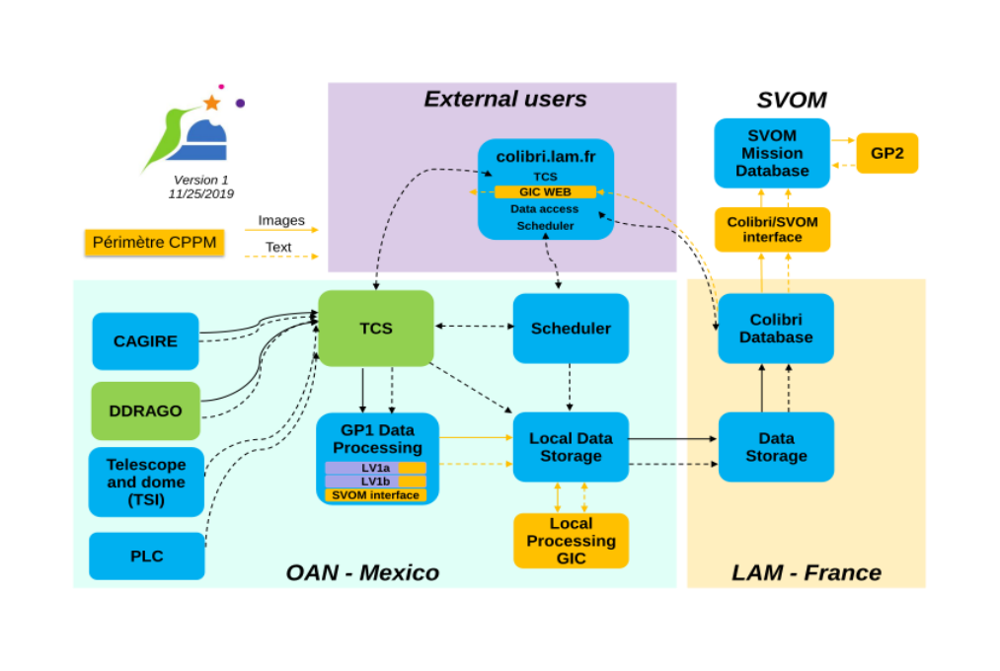

# Contents

# Introduction
Welcome to the Colibri Information System user's manual.
Here you can find all the information you need to retrieve, install and develop with the latest version of GIC COLIBRI.

## Functionalities
GIC COLIBRI is composed of :

- le gic-server   - recoit des données brut et genere des données sous forme d'api pour les interfaces web
- le gic-webC     - permet de visualiser les données d’état à moyen et long terme de l’observatoire
- le gic-webS     - Interface de l'utilisateur du Centre instrumental (GIC orienté svom) 

TODO
..détails modules
colibri-interface

## History

| date        | Module      |Détails      |
| ------|-----|-----|
| 01/09/2021|gic-server | the sources are in OHP (Observatoire de Haute-Provence) 192.168.100.27 on Vpn server vpn.colibri-obs.org.|
| 01/09/2021|gic-webC| the sources are in OHP (Observatoire de Haute-Provence) 192.168.100.27 on Vpn server vpn.colibri-obs.org.|
| 01/09/2021|gic-webS: |- the sources are in IJCLAB https://fsc.svom.org/ |
|           |gic-webS: |- You can find here the complete public repository: https://drf-gitlab.cea.fr/svom/gic/gic-webs.|
| 01/12/2021|-----|- the sources are in CC https://fsc.svom.eu|
|           |-----|You can find here the complete public repository: https://drf-gitlab.cea.fr/svom/gic/gic-webs.|

colibri-interface :
            - You can find here the complete public repository: https://drf-gitlab.cea.fr/svom/gic/colibri-interface
 

## About this software

The GIC-WEB modules have been developed by the CPPM 

CPPM
163, avenue de Luminy - Case 902
13288 Marseille cedex 09
Téléphone : +33 4 91 82 72 00
Télécopie : +33 4 91 82 72 99

## Authors

Here is the list of people involved in the development:

 - Michel AGERON         : Centre de Physique des Particules de Marseille (CPPM/CNRS)
 - Hafid BENAMAR-AISSA   : Centre de Physique des Particules de Marseille (CPPM/CNRS)

## Requirements
