# User doc

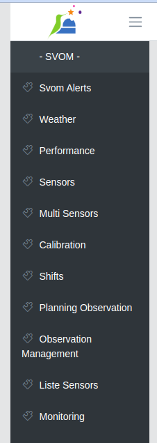

## Home

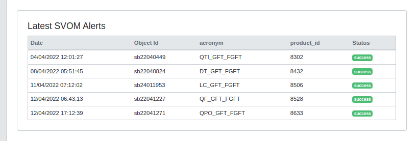

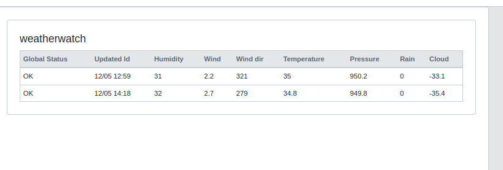

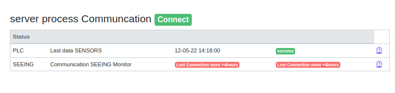

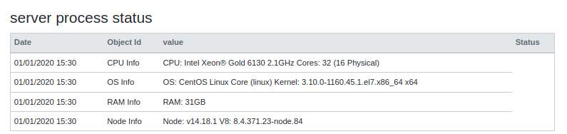

## Svom Alerts

## Weather 

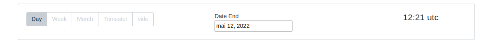

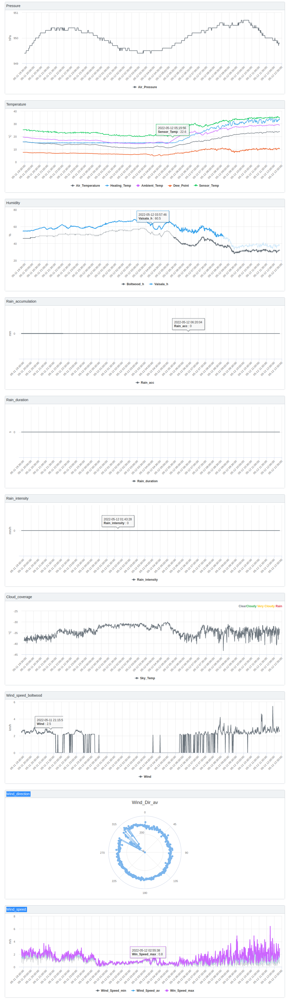

## Performance
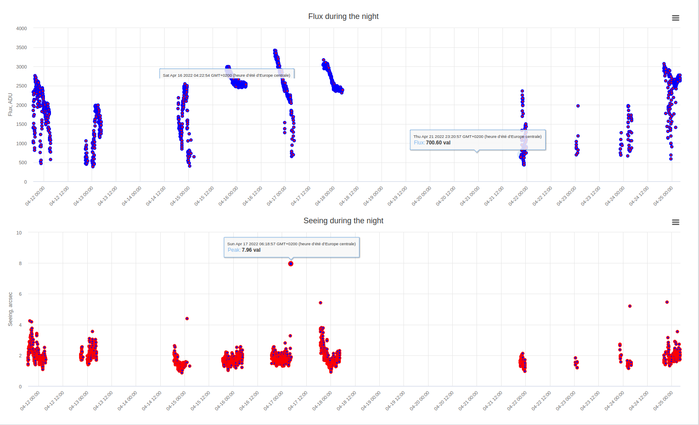
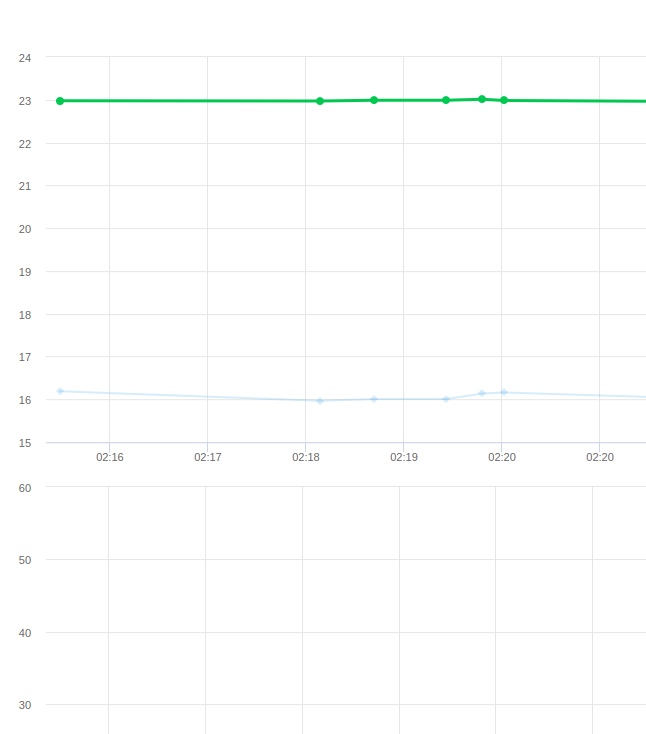

## Sensors

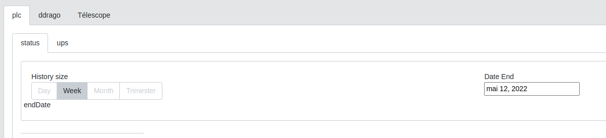

## Multi Sensors
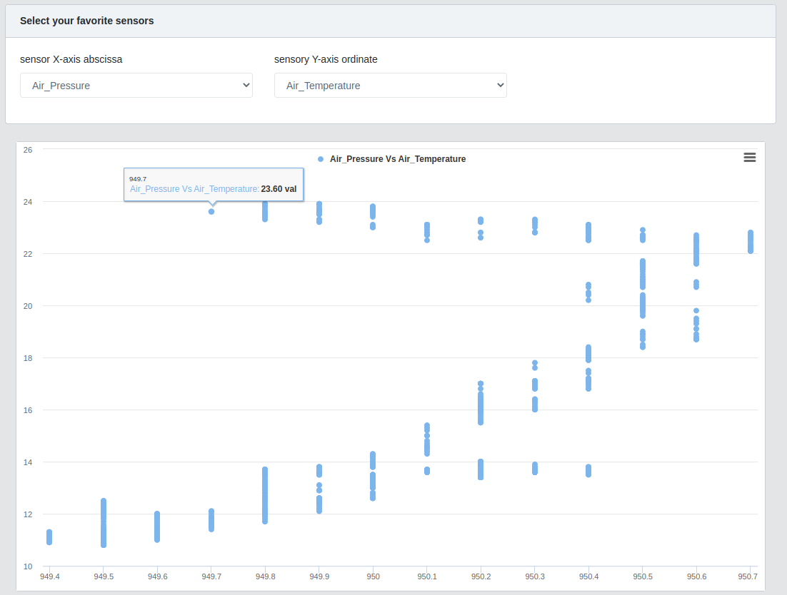

## Calibration
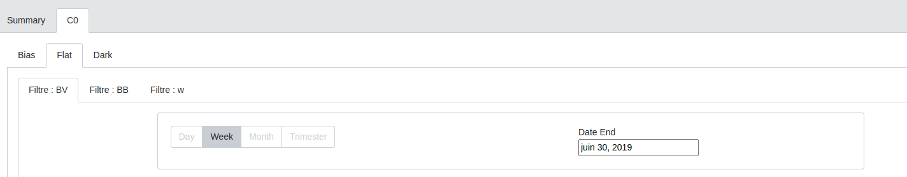
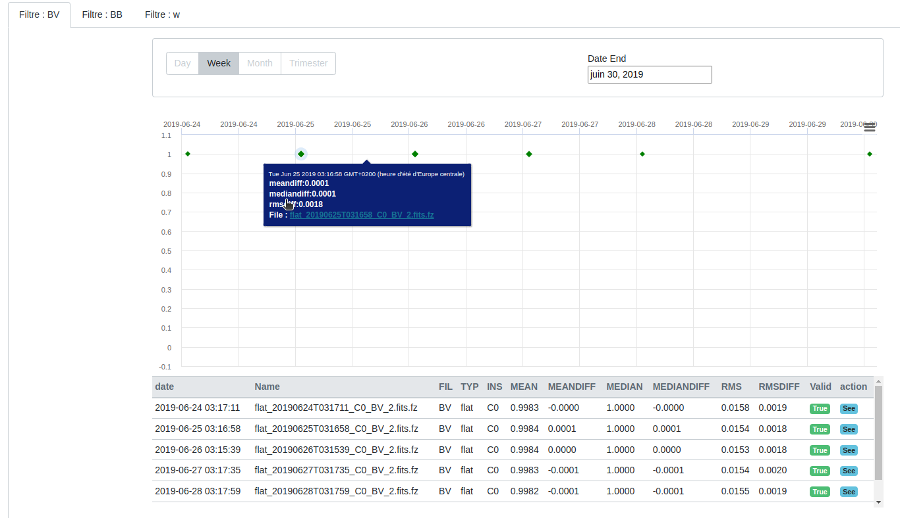

## Shifts

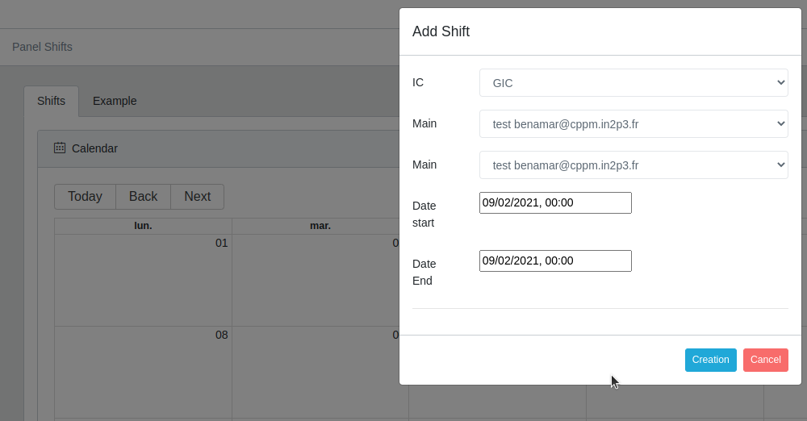

## Planning Observation
## Observation Management
## Liste sensors
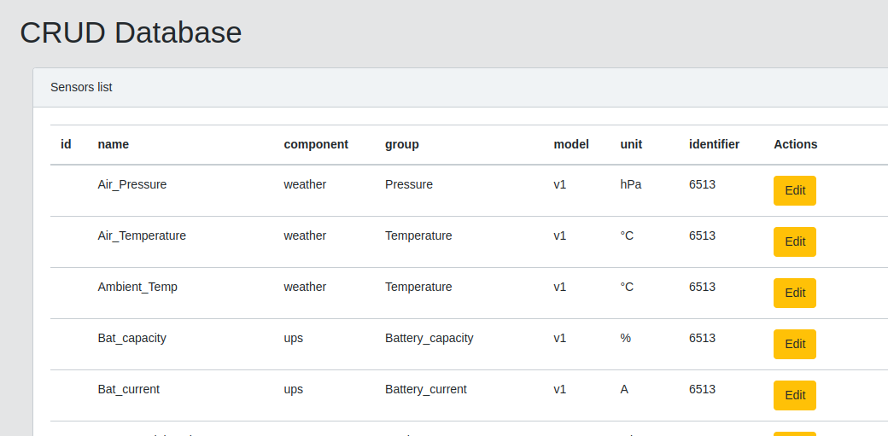

## Monitoring

