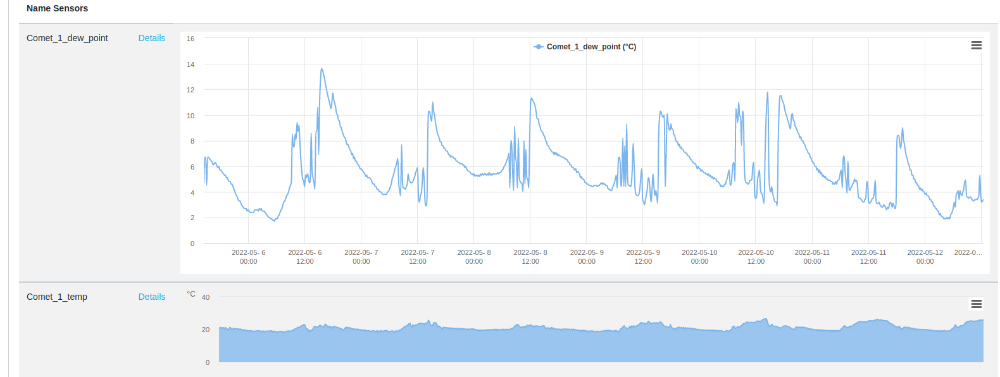
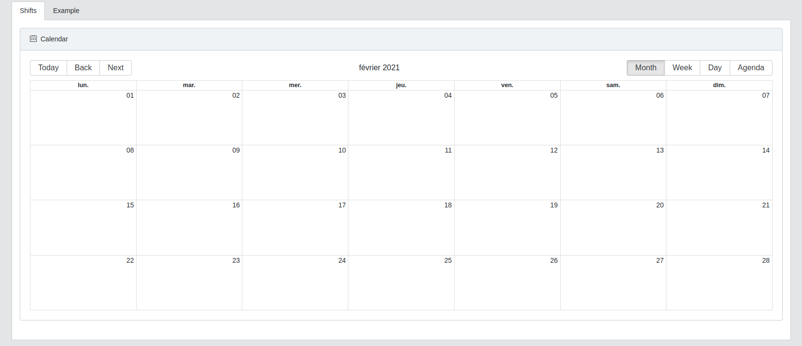

# User doc

## Home

## Svom Alerts

## Weather 

## Performance

## Sensors

## Multi Sensors

## Calibration

## Shifts

## Planning Observation
## Observation Management
## Liste sensors

## Monitoring

